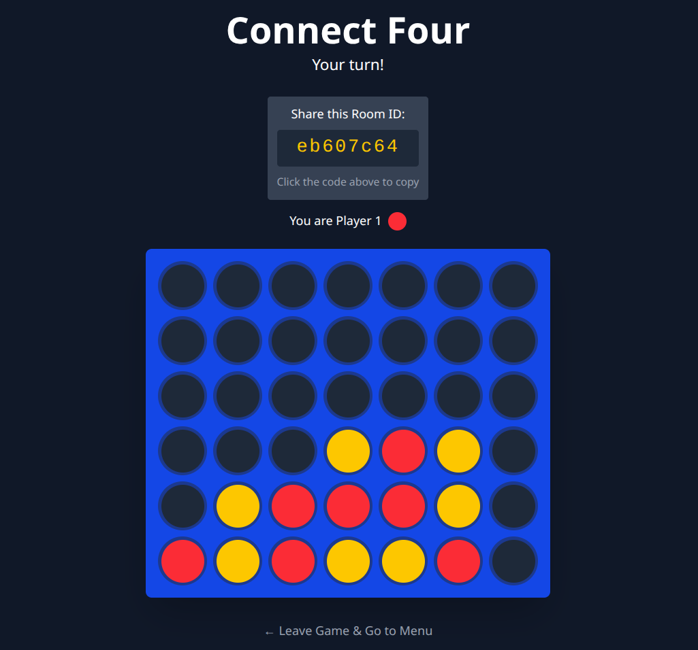

# 🔴🟡 Connect Four: Real-Time Multiplayer & AI Game

This is a full-stack, web-based implementation of the classic Connect Four game. It features real-time gameplay using WebSockets, allowing users to play against a challenging AI or compete with friends in private rooms.

## 🚀 Live Demo

[](https://connect-four-game-z1rn.onrender.com/)

**

## ✨ Features

* **Real-Time Gameplay:** Powered by FastAPI WebSockets for an instant, responsive experience.
* **Two Game Modes:**
    * 👤 **Single Player:** Challenge a smart AI opponent.
    * 👥 **Multiplayer:** Create a private game room and share the ID with a friend to play.
* **Challenging AI:** The AI uses the **Minimax algorithm with Alpha-Beta Pruning** to make strategic moves.
* **Modern Frontend:** A clean, responsive, and modular user interface built with **React**, **Vite**, and **Tailwind CSS**.
* **Simple & Intuitive UI:** Easily start a game, make moves, and see the game status at a glance.

---

## Tech Stack

The project is built with a modern, high-performance tech stack.

### Backend
* **Framework:** [FastAPI](https://fastapi.tiangolo.com/)
* **Language:** Python 3
* **Real-Time Communication:** WebSockets
* **Server:** [Uvicorn](https://www.uvicorn.org/)

### Frontend
* **Library/Framework:** [React](https://reactjs.org/)
* **Build Tool:** [Vite](https://vitejs.dev/)
* **Styling:** [Tailwind CSS](https://tailwindcss.com/)
* **Language:** JavaScript (JSX)

---

## 🛠️ Getting Started

Follow these instructions to get a copy of the project up and running on your local machine.

### Prerequisites

Make sure you have the following installed:
* [UV](https://docs.astral.sh/uv/)
* [Git](https://git-scm.com/)
* [Python 3.8+](https://www.python.org/downloads/) & `pip`
* [Node.js](https://nodejs.org/en/) & `npm`

# Installation & Setup

## 1. Clone the Repository
```bash
git clone https://github.com/AkshayJadhav96/Real-Time-Connect-Four-Game.git
cd Real-Time-Connect-Four-Game
```

## 2. Set up the backend

Navigate to the backend directory
```bash
cd backend
```

Create and activate a virtual environment
```bash
uv init
```

Install the required Python packages
```bash
uv sync
```

## 3. Set up the Frontend
Navigate to the frontend directory from the root
```bash 
cd frontend
```

Install the required npm packages
```bash
uv run npm install
```

## Running the Application
#### You'll need to run both the backend and frontend servers simultaneously in separate terminal windows.

Start the Backend Server
In the /backend directory
```bash 
uv run uvicorn main:app --reload
```

Start the Frontend Development Server
In the /frontend directory
```bash
npm run dev
```

The frontend will be available at http://localhost:5173 (or another port if 5173 is in use).

Open Your Browser
Navigate to http://localhost:5173 to play the game!

## 🎮 How to Play
Open the application in your browser.

Choose a game mode:

Play with AI: Starts a game immediately against the computer. You are Player 1 (Red).

Play with a Friend: Takes you to the multiplayer menu.

For Multiplayer:

Create a Room: Click this to generate a unique Room ID. Share this ID with your friend.

Join a Room: Your friend can enter the Room ID you shared and click "Join Room" to start the game.

## 🔮 Future Improvements

Game State Persistence: Use a database like Redis to maintain game states across server restarts.

User Authentication: Add player profiles and track win/loss records.
